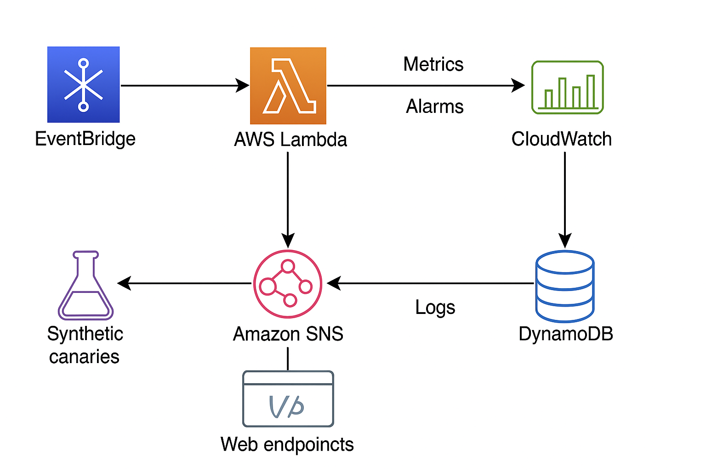
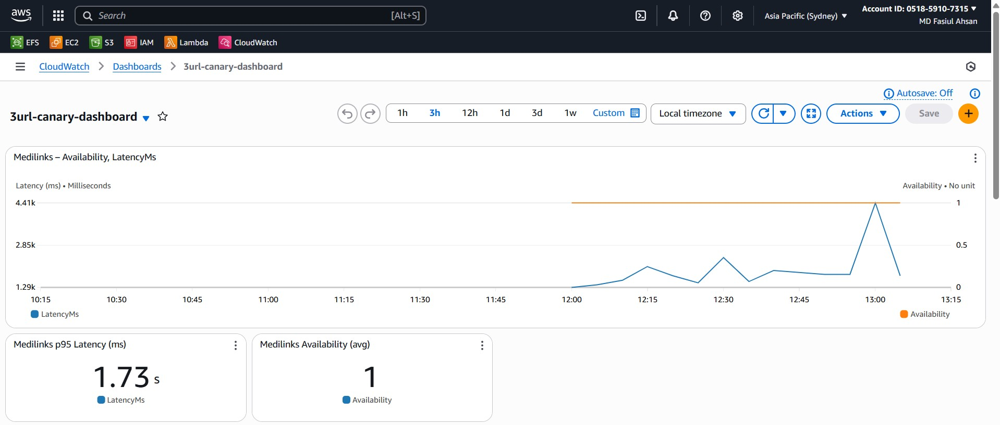
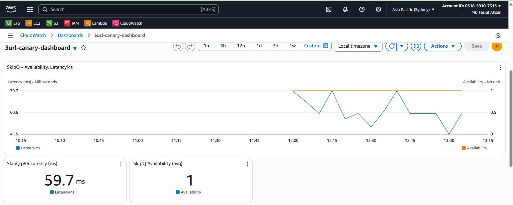
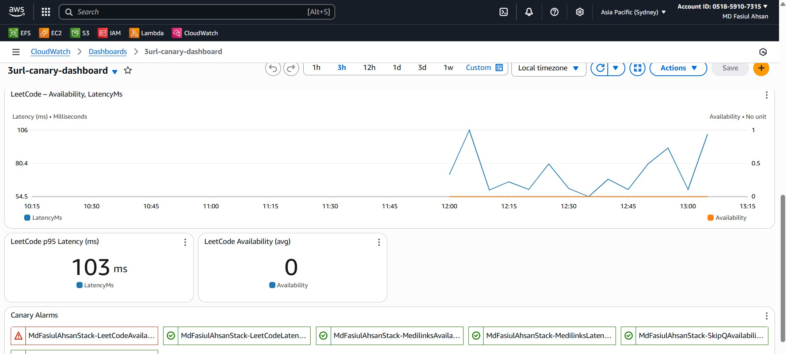
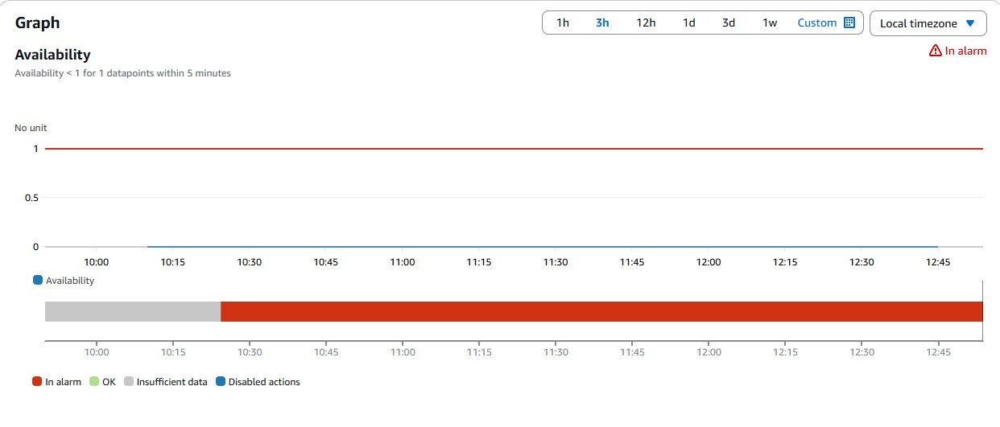
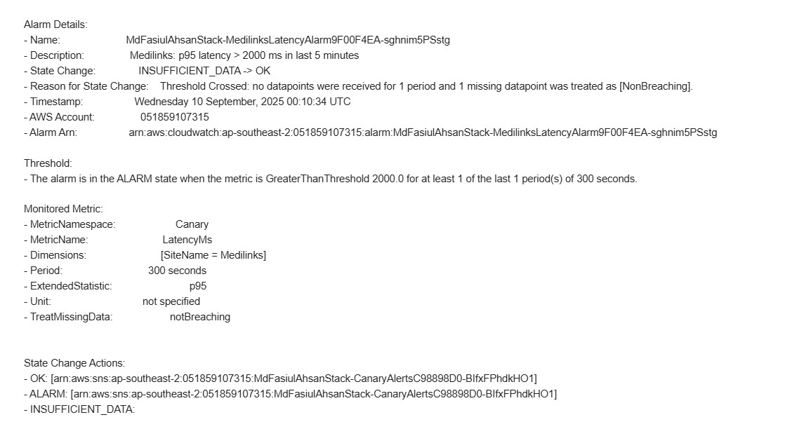

# Advanced DevOps Project – AWS Monitoring & Automation

## 📌 Project Overview
This project demonstrates a complete **DevOps monitoring and alerting system** using AWS services.  

It integrates:  
- **CloudWatch** for metrics and alarms  
- **SNS** for notifications  
- **DynamoDB** for storing monitoring data  
- **Canary scripts (Python + Boto3)** for site health checks  
- **Infrastructure-as-Code (IaC)** with AWS CDK  

The goal of the project is to provide a **resilient monitoring architecture** that detects failures, sends alerts, and logs incidents automatically.

---

## 🏗️ Architecture Diagram
This diagram illustrates how all AWS services are connected:  
- Canary → CloudWatch → Alarms → SNS + DynamoDB  

*(Insert architecture diagram here)*  


---

## 🎯 Goals
- Build a fully automated **monitoring and alerting system**  
- Deploy infrastructure using **AWS CDK**  
- Enable **site health checks** via Python canary scripts  
- Store incident logs in **DynamoDB** for historical analysis  
- Send **SNS notifications** on alarms and failures  

---

## 🔄 Project Flow & Data
1. **Canary Script** pings target websites.  
2. Metrics are pushed to **CloudWatch**.  
3. **CloudWatch Alarms** trigger when thresholds are breached.  
4. Alerts are sent to **SNS Topics** (Email/SMS).  
5. **DynamoDB** logs incidents for auditing.  

## 🔄 Project Flow & Data



---

## 📊 Dashboard & Alarms
- **Custom CloudWatch Dashboard** to track latency, availability, and error rates.  
- Alarms configured for:  
  - High latency  
  - Website downtime  
  - Failed health checks  

**Screenshots:**  
- Dashboard → metrics in real time  
- Alarm → example of triggered alert  

## 📊 Dashboard & Alarms


---

## 🔒 Security & Non-Functional Requirements (NFRs)
To ensure system reliability and security:  
- IAM roles with **least-privilege access**  
- Encrypted storage for logs in DynamoDB  
- Monitoring scripts run in **isolated Lambda functions**  
- Scalability ensured through serverless architecture  

*(Screenshot: IAM Role details in AWS console)*  

---

## ⚠️ Forced Failure Scenarios
To validate the monitoring system, **failure scenarios** were tested:  
1. **Shutting down EC2 instance** hosting the monitored site.  
2. **Blocking inbound traffic** to simulate downtime.  
3. **Artificial latency injection** in the canary script.  

Each failure correctly triggered alarms and **SNS notifications**.  

## ⚠️ Forced Failure Scenarios



---

## 🚀 Deployment
The project was deployed using **AWS CDK** with the following steps:

```bash
# Synthesize CloudFormation templates
cdk synth

# Deploy the stack with verbose logging
cdk deploy -v
